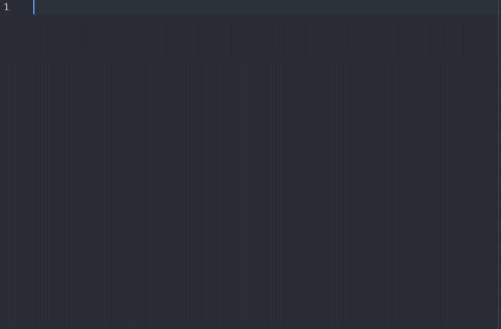

# Mocha Snippets

Snippets for Mocha in Atom.



## Snippets

### describe

```
describe("", function(){

});
```

### context

```
context("", function(){

});
```

### it

```
it("", function(){

});
```
### specify

```
specify("", function(){

});
```

### before

```
before(function(){

});
```

### beforeEach

```
beforeEach(function(){

});
```

### after

```
after(function(){

});
```

### afterEach

```
afterEach(function(){

});
```

### pending

```
it("");
```

### retries

```
this.retries(integer);
```

### timeout

```
this.timeout(milliseconds);
```
